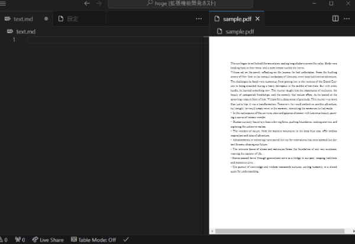
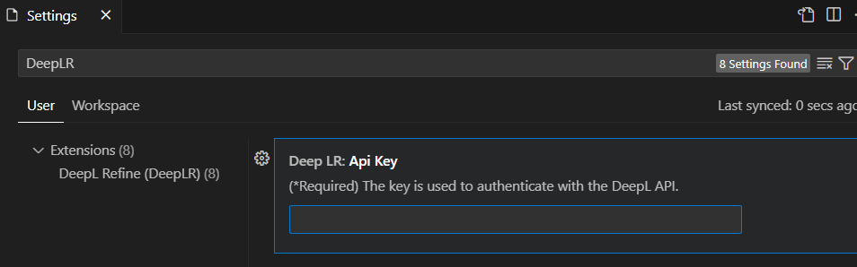
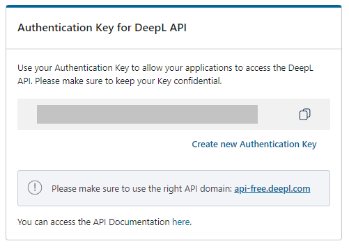

# DeepL Refine (DeepLR)

PDFからコピーしたテキストは、不要な改行やハイフネーションにより単語が途切れることがあり、そのままではDeepLでうまく翻訳できません。DeepL Refine (DeepLR) は、これらの改行やハイフンを適切に処理した後、DeepL APIを用いて翻訳します。

English:

Texts copied from PDFs can have unwanted line breaks or words broken up due to hyphenation. This can hinder proper translation with DeepL. DeepL Refine (DeepLR) addresses this issue by removing these unwanted elements and then utilizing the DeepL API for translation.

## Disclaimer (免責事項)

このプラグインは非公式であり、プラグインやそのドキュメント内で言及されているどの企業やサードパーティサービスとも関連していないことをご了承ください。このプラグインの使用は自己責任となります。このプラグインの開発者は、使用によって生じる可能性のある問題、損害、損失についての責任を負いません。

English:

Please note that this plugin is unofficial and not affiliated with or endorsed by any company or third-party service mentioned within the plugin or its documentation. Use this plugin at your own risk. The developer(s) of this plugin are not responsible for any issues, damages, or losses that may arise from its use.

## Requirements

本非公式プラグインは DeepL API を用います。そのため、DeepL APIの認証キーが必須です。あなたの[DeepL API認証キー](https://www.deepl.com/ja/account/summary)を設定してください。

DeepL API については[公式サイト](https://www.deepl.com/pro-api?cta=header-pro-api)を参照してください。

English:

This unofficial plugin utilizes the DeepL API. Therefore, a [DeepL API authentication key](https://www.deepl.com/account/summary) is essential. Make sure to set up your DeepL API authentication key.

For more information on the DeepL API, please visit the [official website](https://www.deepl.com/pro-api?cta=header-pro-api).

## Features

- DeepL APIを利用した翻訳
- 改行やハイフンの削除後、DeepL APIでの翻訳
  -  改行の削除
  -  空行は改行として保持
  -  デフォルト設定では "•" および "-" をリストの開始文字として認識し、その改行を保持
  -  「.」の直後の改行も保持
- 改行やハイフンの削除によるテキストの置換

English:

- Translation using the DeepL API
- Translation after removing line breaks and hyphens using the DeepL API
  -  Removal of line breaks
  -  Empty lines are recognized and kept as breaks
  -  By default, "•" and "-" are considered list starters, and associated line breaks are kept
  -  Line breaks right after a period are preserved
- Replacement of text after removal of line breaks and hyphens

|        コマンド        |              コマンド名               | 説明                                                                   |
| :--------------------: | :-----------------------------------: | :--------------------------------------------------------------------- |
| deeplr.removeLineBreak |     DeepLR: 選択範囲の改行を削除      | 選択範囲の改行を削除します。翻訳は実行しません。                       |
|   deeplr.translate1    |          DeepLR: 言語1に翻訳          | 選択範囲の文章を設定の「言語1」に翻訳します。改行の削除はしません。    |
|   deeplr.translate2    |          DeepLR: 言語2に翻訳          | 選択範囲の文章を設定の「言語2」に翻訳します。改行の削除はしません。    |
|   deeplr.translate3    |      DeepLR: 言語を選択して翻訳       | 選択範囲の文章を翻訳します。改行の削除はしません。                     |
|   deeplr.translate4    |       DeepLR: 最後の言語に翻訳        | 選択範囲の文章を最後に使用した言語に翻訳します。改行の削除はしません。 |
|   deeplr.translate1C   |    DeepLR: 言語1に翻訳 (改行削除)     | 選択範囲の文章を設定の「言語1」に翻訳します。                          |
|   deeplr.translate2C   |    DeepLR: 言語2に翻訳 (改行削除)     | 選択範囲の文章を設定の「言語2」に翻訳します。                          |
|   deeplr.translate3C   | DeepLR: 言語を選択して翻訳 (改行削除) | 選択範囲の文章を翻訳します。                                           |
|   deeplr.translate4C   |  DeepLR: 最後の言語に翻訳 (改行削除)  | 選択範囲の文章を最後に使用した言語に翻訳します。                       |

|        Command         |              Command Display Name              | Description                                                                              |
| :--------------------: | :--------------------------------------------: | :--------------------------------------------------------------------------------------- |
| deeplr.removeLineBreak |           DeepLR: Delete linebreaks            | Removes line breaks in the selected range. Does not perform translation.                 |
|   deeplr.translate1    |         DeepLR: Translate to Language1         | Translates the selected text to the configured "Language1". Does not remove line breaks. |
|   deeplr.translate2    |         DeepLR: Translate to Language2         | Translates the selected text to the configured "Language2". Does not remove line breaks. |
|   deeplr.translate3    |            DeepLR: Translate to ...            | Translates the selected range. Does not remove line breaks.                              |
|   deeplr.translate4    |       DeepLR: Translate to Last Language       | Translates the selected text to the last used language. Does not remove line breaks.     |
|   deeplr.translate1C   |   DeepLR: Translate to Language1 (Condensed)   | Translates the selected text to the configured "Language1".                              |
|   deeplr.translate2C   |   DeepLR: Translate to Language2 (Condensed)   | Translates the selected text to the configured "Language2".                              |
|   deeplr.translate3C   |      DeepLR: Translate to ... (Condensed)      | Translates the selected range.                                                           |
|   deeplr.translate4C   | DeepLR: Translate to Last Language (Condensed) | Translates the selected text to the last used language.                                  |

## Extension Settings

- `DeepLR.apiKey` : The key is used to authenticate with the DeepL API.
- `DeepLR.preserveOriginalText` : When enabled, the original text will be retained alongside the translation. Otherwise, it will be replaced by the translated text.
- `DeepLR.language1` : Output ISO 639-1 language1 name.(exp: en-US, fr, de, ja)
- `DeepLR.language2` : Output ISO 639-1 language2 name.(exp: en-US, fr, de, ja)
- `DeepLR.treatBlankLinesAsBreaks` : Consider blank lines as a line break.
- `DeepLR.retainHyphenation` : Retain hyphen following an alphabet character.
- `DeepLR.preserveBreaksAfterDots` : Preserve the line break immediately following a line ending with a dot.
- `DeepLR.listStartingCharacters` : Specify characters used at the beginning of a list. Sentences starting with characters included in the specified string will be recognized as list items, and the preceding line break will be preserved.

## Release Notes

### 0.0.2

Insert space.

### 0.0.1

Initial release

## Privacy Policy

この非公式プラグインはDeepL APIを呼び出すためのものであり、それ以外の目的でテキストを送信または保存することはありません。テキストの翻訳はDeepLのオンラインサービスを経由して行われます。DeepLのプライバシーポリシーに関しては、[こちら](https://www.deepl.com/privacy.html)をご覧ください。DeepLのプライバシーポリシーに同意できない場合は、この拡張機能の翻訳機能の使用を控えてください。

English:

This unofficial plugin solely calls the DeepL API and does not send or store texts for any other purposes. Translations are carried out via DeepL's online service. Please take a look at [DeepL's privacy policy](https://www.deepl.com/privacy.html). Refrain from using the translation feature of this extension if you do not agree with their privacy policy.
